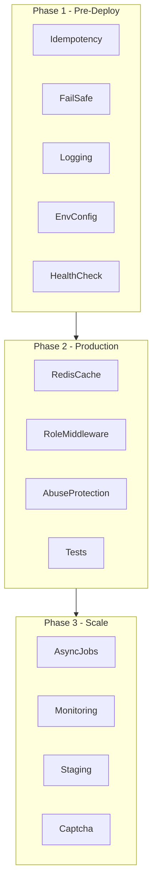
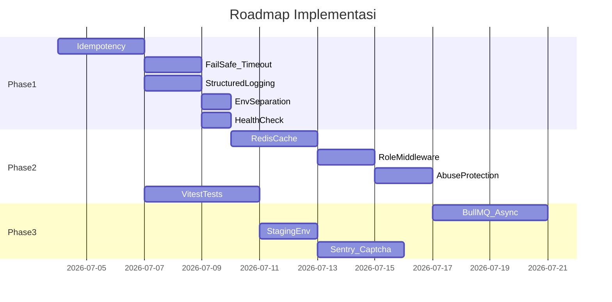

# Production Hardening — Backend BaeBack

## Konteks saat ini

Backend sudah ada di [`server/`](server/) dengan:
- Auth JWT via Supabase ([`server/middleware/auth.js`](server/middleware/auth.js))
- Rate limit IP ([`server/index.js`](server/index.js))
- In-memory cache ([`server/lib/cache.js`](server/lib/cache.js))
- Error handler basic ([`server/middleware/errorHandler.js`](server/middleware/errorHandler.js))
- Frontend sudah disable tombol saat submit ([`src/pages/CampaignDetailPage.jsx`](src/pages/CampaignDetailPage.jsx))

Yang **belum ada**: idempotency, role check di backend, structured logging, timeout, health check Supabase, tests, env separation, Redis, async jobs.

**Keputusan hosting:** Railway/Render/Fly.io (long-running Express) — BullMQ + Redis natural fit, tidak perlu refactor ke Vercel serverless.



---

## Phase 1 — Wajib sebelum deploy pertama (1-2 minggu)

### 1. Idempotency — anti double donation (PRIORITAS TERTINGGI)

**Problem:** Double-click / retry network → 2 record donasi.

**Solusi bertingkat:**

| Layer | Implementasi |
|-------|-------------|
| Frontend | Generate `Idempotency-Key` (UUID) per submit, kirim di header; tombol tetap disabled |
| Backend | Middleware baca header `Idempotency-Key`, simpan di Redis (Phase 2) atau DB sementara |
| Database | Kolom `idempotency_key text unique` di `donations` + migrasi baru |

File kunci: [`server/services/donations.js`](server/services/donations.js), [`server/routes/donations.js`](server/routes/donations.js), migrasi baru `supabase/migrations/202607040001_donation_idempotency.sql`

Flow:
```
POST /donations + Idempotency-Key
  → cek key exists? return 200 + donation lama (bukan 409)
  → insert dengan unique constraint
  → duplicate? return donation existing
```

### 2. Fail-safe & error handling

Tambah di [`server/lib/supabase.js`](server/lib/supabase.js):
- **Timeout wrapper** (8-10 detik) untuk semua query Supabase
- **Retry 1x** hanya untuk error network/5xx, bukan validation

Perbaiki [`server/middleware/errorHandler.js`](server/middleware/errorHandler.js):
- Jangan pernah expose `error.message` dari Supabase ke client
- Map error DB ke pesan generik: `"Terjadi kesalahan, coba lagi nanti."`
- Log detail error ke structured logger (bukan ke response)

Tambah **circuit breaker ringan** di [`server/services/campaigns.js`](server/services/campaigns.js):
- Jika Supabase gagal 3x berturut → return stale cache jika ada, else 503 dengan pesan clean

### 3. Logging & request tracing

Buat [`server/lib/logger.js`](server/lib/logger.js):
- Dev: pretty console (pino-pretty)
- Prod: JSON structured (pino) — siap di-parse Logtail/Axiom

Buat [`server/middleware/requestLogger.js`](server/middleware/requestLogger.js):
- Request ID (`X-Request-Id`) per request
- Log: method, path, status, duration, userId (jika auth), IP

Wire di [`server/index.js`](server/index.js) sebelum routes.

**Monitoring prod (Phase 2 deploy):** Sentry untuk uncaught errors — 1 env var `SENTRY_DSN`, minimal setup.

### 4. Environment separation

Perluas [`server/config.js`](server/config.js):

```js
// Validasi per environment
development: CORS localhost, log verbose
production:  CORS strict whitelist, log warn+
staging:     mirror production, Supabase project terpisah
```

File env:
- `.env.development` (local)
- `.env.staging` (Railway staging service)
- `.env.production` (Railway prod service)

Tambah validasi startup: di production, tolak jika `CORS_ORIGIN=*` atau service role key kosong.

Update [`.env.example`](.env.example) dengan semua variabel + komentar per environment.

### 5. Health check yang meaningful

Upgrade `GET /api/health` di [`server/index.js`](server/index.js):

```json
{
  "status": "ok" | "degraded",
  "checks": {
    "supabase": "ok" | "fail",
    "redis": "ok" | "skip" | "fail"
  },
  "uptime": 12345
}
```

Railway/Render bisa pakai endpoint ini untuk health probe. Return 503 jika Supabase down.

---

## Phase 2 — Production hardening (minggu 3-4)

### 6. Redis cache (Upstash atau Redis Railway add-on)

Refactor [`server/lib/cache.js`](server/lib/cache.js) → adapter pattern:

```
cache/
  memory.js    (fallback dev)
  redis.js     (production)
  index.js     (auto-pick dari REDIS_URL)
```

**Prinsip:** DB adalah source of truth; cache hanya accelerator. Jika Redis down → fallback ke DB langsung (bukan error).

Tetap invalidate cache setelah donasi di [`server/services/donations.js`](server/services/donations.js).

### 7. Role system di backend

DB sudah punya `profiles.role` (`user` | `admin`) dari migrasi MVP.

Tambah:
- [`server/middleware/requireRole.js`](server/middleware/requireRole.js) — fetch role dari `profiles` via service role, cache 5 menit per userId
- Siapkan route placeholder admin (belum UI penuh):
  - `GET /api/admin/campaigns` — list all status
  - `POST /api/admin/campaigns` — create campaign
  - `PATCH /api/admin/campaigns/:id` — update status

**Rule:** Frontend `AdminRoute` tetap ada untuk UX, tapi **backend selalu re-check role** — jangan percaya frontend.

### 8. Abuse protection (charity-specific)

Perluas rate limiting di [`server/index.js`](server/index.js):

| Limit | Scope | Nilai awal |
|-------|-------|-----------|
| Donasi per IP | 10/menit | sudah ada |
| Donasi per user | 20/hari | baru — butuh Redis counter |
| Donasi per user per campaign | 5/jam | cegah spam ke 1 campaign |
| Nominal identik | 30 detik | block duplicate amount+campaign+user |

Tambah [`server/middleware/abuseGuard.js`](server/middleware/abuseGuard.js) sebelum create donation.

**Captcha (Phase 3):** Turnstile/hCaptcha di frontend + verify token di backend sebelum insert.

### 9. Testing minimal

Setup **Vitest** + **supertest**:

```
server/
  __tests__/
    donations.test.js
    campaigns.test.js
    auth.test.js
```

Test wajib:
- `POST /donations` — auth required, validation amount, idempotency key
- `POST /donations` — duplicate key returns same result
- `GET /campaigns` — pagination, cache header
- Error responses tidak expose DB message

Mock Supabase client di test — jangan hit DB real di CI.

Tambah script: `"test": "vitest run"`, `"test:watch": "vitest"`.

CI: GitHub Action run `lint` + `test` on PR.

---

## Phase 3 — Scale & observability (bulan 2)

### 10. Background jobs / async

Karena Railway long-running, pakai **BullMQ + Redis**:

```
server/jobs/
  queue.js          # BullMQ connection
  workers.js        # start workers (same process atau worker service terpisah)
  processors/
    logDonation.js  # audit log async
    notifyDonor.js  # future: email/notifikasi
```

**Phase 3a (tanpa queue dulu):** `setImmediate()` untuk fire-and-forget logging — bridge sambil Redis belum ready.

**Phase 3b:** Pindah ke BullMQ saat notifikasi email masuk scope.

Donation insert tetap **sync** (user harus dapat response langsung). Yang async: logging, notifikasi, analytics.

### 11. Staging environment

| Service | Dev | Staging | Production |
|---------|-----|---------|------------|
| Frontend | localhost:5173 | staging.baeback.app | baeback.app |
| API | localhost:3001 | api-staging.railway | api.railway |
| Supabase | local/dev project | staging project | prod project |
| Redis | optional local | Upstash staging | Upstash prod |

Workflow: merge ke `main` → deploy staging → smoke test → promote ke prod.

### 12. Captcha & bot protection

Integrasi Cloudflare Turnstile (gratis, ringan):
- Frontend widget di form donasi
- Backend verify token sebelum `createDonation`

---

## Yang perlu ditambah (di luar 10 poin briefing)

Item ini sering terlupakan tapi critical untuk client project:

### A. Audit trail donasi & admin
Tabel `donation_events` atau `audit_logs`: siapa, apa, kapan, request_id. Penting untuk dispute charity ("saya sudah donasi tapi tidak tercatat").

### B. Request ID end-to-end
Frontend kirim / terima `X-Request-Id` → user bisa lapor error dengan ID spesifik ke support.

### C. Graceful shutdown
Di [`server/index.js`](server/index.js): handle `SIGTERM` dari Railway — stop accept request, drain in-flight, close Redis connection. Cegah donasi setengah jalan saat deploy.

### D. Database migration workflow
Dokumentasi: migrasi di [`supabase/migrations/`](supabase/migrations/) dijalankan ke staging dulu, baru prod. Jangan manual edit prod.

### E. Backup & incident playbook
- Supabase point-in-time recovery (cek plan)
- Runbook 1 halaman: "Supabase down", "Redis down", "API 503" — apa yang user lihat, apa yang tim lakukan

### F. API versioning
Prefix `/api/v1/` sekarang (sebelum ada client eksternal). Migrasi path di [`src/lib/api.js`](src/lib/api.js) + Vite proxy.

### G. Security headers & CORS production
[`server/index.js`](server/index.js): `cors({ origin: [allowed origins], credentials: true })` — array, bukan string tunggal.

### H. Input sanitization
Strip/escape HTML di field `message` donasi sebelum insert — cegah stored XSS jika message ditampilkan di admin panel nanti.

### I. CI/CD pipeline
GitHub Actions minimal:
```
lint → test → build frontend
deploy API (Railway) on tag
deploy frontend (Vercel/Netlify) on tag
```

### J. Donation limits business rules
Dokumentasi ke client: max donasi per hari per user, apakah donasi anonim allowed, refund policy (status `cancelled` sudah ada di schema).

---

## Prioritas implementasi (urutan eksekusi)



**Deploy pertama aman setelah Phase 1 selesai.**
**Deploy "client-ready" setelah Phase 2 selesai.**

---

## Struktur file baru (target)

```
server/
  lib/
    logger.js
    cache/
      index.js
      memory.js
      redis.js
    supabase.js          (timeout + retry)
  middleware/
    requestLogger.js
    requireRole.js
    abuseGuard.js
    idempotency.js
  jobs/
    queue.js
    processors/
  routes/
    admin/
      campaigns.js
  __tests__/
    donations.test.js
```

---

## Estimasi effort

| Phase | Scope | Effort |
|-------|-------|--------|
| Phase 1 | Idempotency, fail-safe, logging, env, health | ~3-5 hari dev |
| Phase 2 | Redis, roles, abuse, tests, CI | ~5-7 hari dev |
| Phase 3 | BullMQ, staging, Sentry, captcha | ~5-7 hari dev |

Total: **~3-4 minggu** part-time untuk production-grade charity backend.
